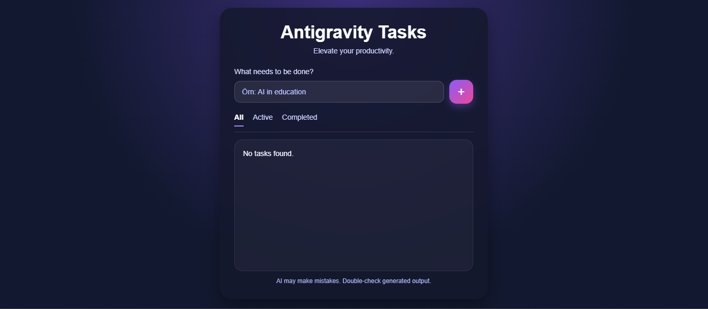
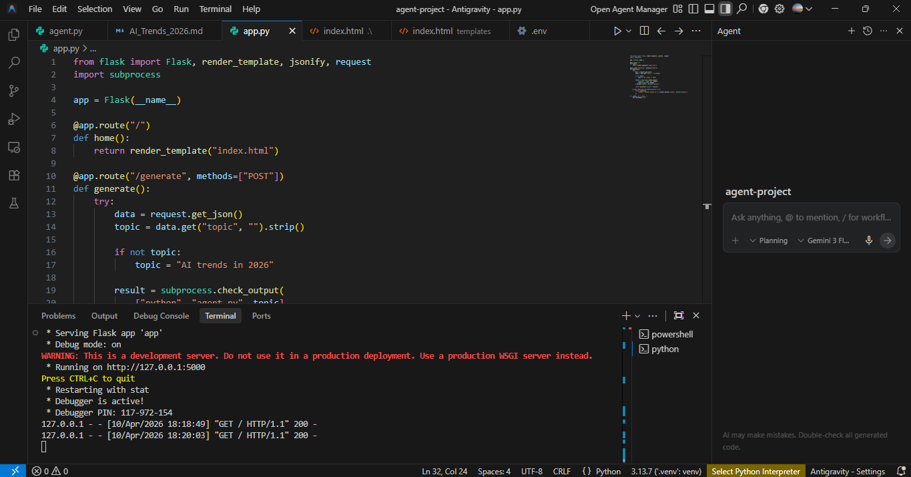

# AI Task Generator (Flask + Gemini)

An AI-powered task generator built with **Flask**, **JavaScript**, and **Gemini API**.

## Live Demo
[Click here to try the app](https://ai-task-generator-flask.onrender.com)

## 📸 Demo

### 🖥️ User Interface


### ⚙️ Backend / API


## 🚀 Features

- Generate AI-powered task ideas from a topic
- Clean and responsive interface
- Simple Flask backend integration
- Gemini API support
- Deployed on Render

## 🛠️ Tech Stack
- Python
- Flask
- JavaScript
- HTML / CSS
- Gemini API
- LiteLLM
- Render

## Project Structure
```bash
ai-task-generator-flask/
│
├── app.py
├── agent.py
├── requirements.txt
├── README.md
├── .gitignore
└── templates/
    └── index.html
```

##Installation

###Clone the repository:

git clone https://github.com/beyzauzun-ai/ai-task-generator-flask.git
cd ai-task-generator-flask

###Install dependencies:

pip install -r requirements.txt

Create a .env file and add your Gemini API key:

GEMINI_API_KEY=your_api_key_here

###Run the app locally:

python app.py
##Example Usage

###Input:

AI in healthcare

###Output:

- AI improves diagnostics by analyzing medical images and patient data.
- Personalized treatment plans can be created with AI support.
- AI accelerates drug discovery and pharmaceutical research.
- 
##Deployment

This project is deployed on Render.

##Notes
AI responses may vary depending on the prompt
API key is required to run the project locally
Author

Beyza Uzun
